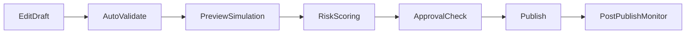

# Admin Console Design

## Purpose
Provide a secure, guided interface where admins can configure organization behavior without direct code or infrastructure access.

## Console Scope
- Organization profile and lifecycle settings.
- Module enablement and feature policies.
- Role and permission configuration.
- Workflow and form builders.
- Notification template management.
- Branding and localization controls.
- Integration setup and credential references.
- Config publish, rollback, and audit views.

## Information Architecture
- Dashboard
  - health summary, pending approvals, recent changes, policy alerts.
- Organization
  - profile, environment status, capacity tier, compliance profile.
- Access Control
  - roles, permissions, approval chains, emergency access policy.
- Process Studio
  - workflow editor, SLA policy editor, escalation matrix.
- Form Studio
  - schema-based form designer with field catalog and rules.
- Communications
  - templates, channels, delivery analytics, fallback rules.
- Integrations
  - connectors, data mappings, sync schedules, failure queue.
- Releases
  - config versions, preview runs, publish history, rollback actions.
- Audit
  - immutable logs, export jobs, access reviews.

## Permission Model
- PlatformSuperAdmin: full control-plane governance.
- OrgAdmin: full org configuration authority, limited by platform guardrails.
- ComplianceOfficer: read across configs/audit plus approval permissions.
- WorkflowManager: manage workflows, forms, and SLA definitions.
- IntegrationManager: manage connectors and data mappings.
- ViewerAuditor: read-only access for audits and oversight.

## Access Control Strategy
- RBAC baseline with ABAC constraints for sensitive operations.
- Fine-grained action scopes (`read`, `write`, `approve`, `publish`, `rollback`).
- Just-in-time elevated access with expiration for emergency actions.

## Safe Change Workflow

## UX Patterns
- Guided setup wizards for first-time org onboarding.
- Inline policy hints and validation errors with actionable fixes.
- Diff views for config changes between versions.
- Simulation mode to preview impact before publish.
- Reusable templates and cloned workflows for faster setup.

## Guardrails
- Block publish on unresolved high-severity validation errors.
- Require dual approval for high-impact policy and permission changes.
- Enforce maintenance windows for risky integration rewiring.
- Prevent deletion of mandatory compliance controls.

## Audit And Transparency
- Display actor, reason, ticket reference, and impact scope for each change.
- Config history timeline with search and export.
- Approval trail with non-repudiation markers.

## Operational Requirements
- P95 console page load under 2 seconds for common screens.
- Autosave drafts with conflict-aware collaborative editing safeguards.
- Complete keyboard navigation and accessible forms/components.
