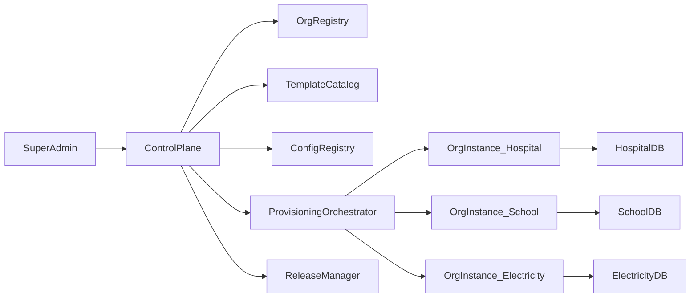

# Architecture Overview

## System Context
The platform uses a shared control plane for governance and lifecycle management, and dedicated data plane instances for each organization.

## Technology Baseline
- Frontend: Next.js (React), design system, server components where suitable.
- API gateway/BFF: Node.js service that centralizes frontend-facing APIs.
- Domain services: FastAPI for core business services and workflow-heavy APIs.
- Messaging: async event bus for notifications, audit pipelines, and integration events.
- Data: relational DB per org instance, cache layer, object storage for documents.
- Infrastructure: container orchestration and IaC for reproducible provisioning.

## Logical Layers
- Experience Layer: admin and operator UIs, role-based navigation.
- API Layer: gateway, auth checks, request aggregation, API versioning.
- Domain Layer: contacts, cases, workflow, reports, notifications, documents.
- Policy Layer: authz policy engine, config policy checks, change approvals.
- Platform Layer: provisioning, config lifecycle, observability, release automation.

## Control Plane Responsibilities
- Organization onboarding and lifecycle state management.
- Config schema validation and versioning.
- Template publication and compatibility mapping.
- Provisioning and upgrade orchestration.
- Fleet observability and compliance posture overview.

## Data Plane Responsibilities
- Serve org-specific runtime traffic.
- Enforce org policy and workflow configuration.
- Maintain org-scoped data stores and secrets.
- Emit telemetry and audit events back to control plane.

## Service Boundaries
- Identity service: SSO integration, sessions, MFA, identity sync.
- Authorization service: RBAC/ABAC evaluation and policy distribution.
- Contact service: person/org records and relationship graph.
- Case service: lifecycle, assignments, SLA clocks, escalations.
- Workflow service: state machines and transition guards.
- Reporting service: aggregates, metrics, export jobs.
- Notification service: template rendering and channel delivery.
- Document service: upload, retrieval, retention tags, legal hold hooks.

## Deployment Topology
- One control plane environment per region.
- One dedicated org data plane instance per organization.
- Optional environment tiers per org: dev, staging, prod.
- Blue/green or canary deployment strategy for lower-risk upgrades.

## API Strategy
- REST-first contracts with versioned endpoints.
- Event-driven integration for asynchronous processes.
- Standard response envelopes and error model across services.

## Data Ownership
- Each domain service owns its write model.
- Cross-domain queries use read models/materialized views.
- Reporting pulls from curated analytics tables to avoid stressing OLTP paths.

## Upgrade Model
- Platform versions tracked separately from org config versions.
- Upgrade gates:
  - Platform compatibility check.
  - Config schema migration validation.
  - Smoke test and rollback policy.
