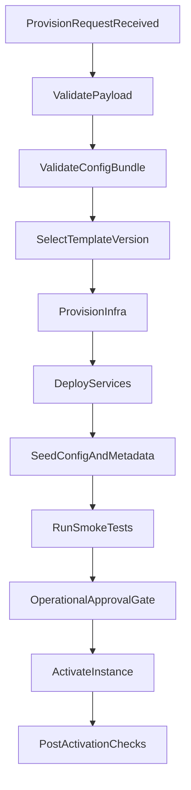

# Tenant And Provisioning Design

## Tenancy Model
- Primary mode: dedicated instance per organization.
- Shared control plane manages provisioning and governance.
- Each organization has isolated compute, data, secrets, and integration credentials.

## Isolation Boundaries
- Compute isolation: dedicated namespace or node pool policy.
- Data isolation: dedicated database per organization.
- Cache isolation: dedicated cache DB/index and key prefix policy.
- Storage isolation: dedicated object storage bucket/prefix and IAM policy.
- Secret isolation: per-org secret scope and key rotation lifecycle.

## Provisioning Inputs
- Organization profile (type, size tier, region, compliance flags).
- Selected domain template (hospital, school, electricity, base generic).
- Config bundle (modules, roles, workflows, forms, channels, integrations).
- Capacity policy (users, concurrency, storage, retention).

## Provisioning Workflow

## Provisioning States
- Requested
- ValidationFailed
- ProvisioningInProgress
- ProvisioningFailed
- AwaitingApproval
- Active
- Suspended
- Retired

## Rollback Strategy
- If provisioning fails before activation: destroy partial resources and close as failed.
- If activation checks fail: auto-rollback to last known-good image/config.
- Keep provisioning logs and run metadata for root-cause analysis.

## Drift Management
- Periodic IaC drift scans for every org environment.
- Config drift checks between control-plane registry and runtime applied state.
- Automatic ticketing for drift with severity classification.

## Sizing And Scaling
- Sizing tiers: Small, Medium, Large, Enterprise.
- Autoscaling profiles tied to org tier and workload shape.
- Scale triggers: request latency, queue depth, CPU/memory saturation.

## Backup And Recovery
- Database backups with tier-based frequency.
- Point-in-time recovery window by compliance policy.
- Object storage versioning for document durability.
- Quarterly restore drills and evidence capture.

## Deprovisioning
- Soft retirement period for legal/data retention.
- Export archive generation and checksum verification.
- Hard delete only after retention period and approval workflow completion.
